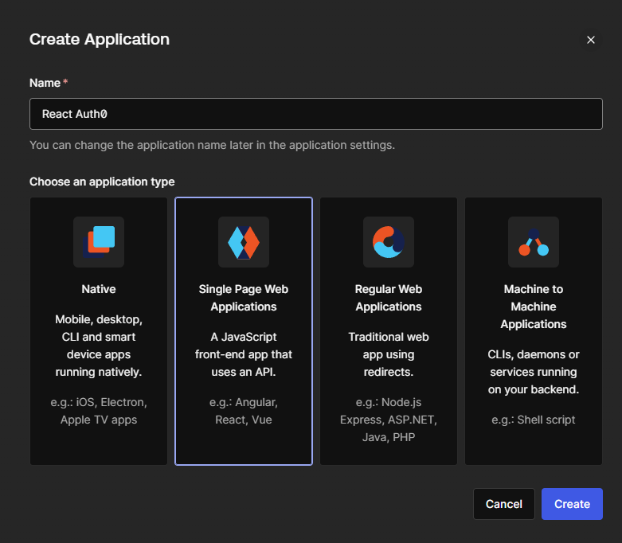
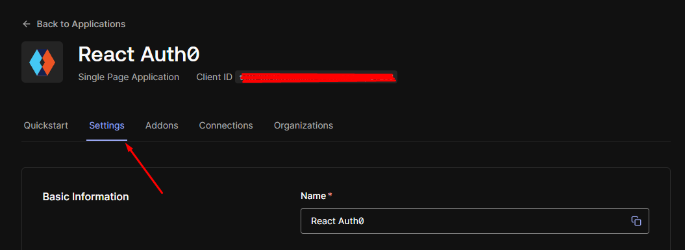

# CS3219 Toolbox - Authentication and Authorization
The CS3219 SE Toolbox is a collection of guides and resources to help you get started with the various tools and technologies used CS3219 - Software Engineering Principles and Patterns.

The guides and resources below focus on authentication and authorization. Specifically, JSON Web Tokens (JWT) and Auth0. 

# 1. Introduction
This guide aims to help you learn the basics of different authentication and authorization mechanisms. Specifically, JSON Web Tokens (JWT) and Auth0. These technologies play a crucial role in securing web applications by ensuring that only authorized users can access certain resources. 

<sup> ^This text was generated with the help of [ChatGPT](https://chat.openai.com/). </sup>

## 1.1. Authentication vs Authorization
The table below summarizes the differences between authentication and authorization.
| Authentication | Authorization |
| --- | --- |
| Verifies the identity of a user | Verifies whether a user has access to a resource |
| Usually done before authorization | Usually done after authentication |
| Authentication factors like passwords, tokens, biometrics, etc. are used | Factors like roles, permissions, access control lists, etc. are used |
| Eg. Logging in to a website | Eg. Accessing a file on a server, editing a document |

There are many technologies used to implement authentication and authorization. Some of the most popular ones are:
- JSON Web Tokens (JWT)
- OAuth (eg. Auth0)
- OpenID Connect (OIDC)
- SAML
- ...etc

In this guide, we will be focusing on JWT and Auth0. We will use both of these technologies to implement authentication and authorization in a sample web application. Section 2 will cover JWT and section 3 will cover Auth0.

# 2. JSON Web Tokens (JWT)
A JSON Web Token (JWT) is an open standard for securely transmitting information between parties as a JSON object. This information can be verified and trusted because it is digitally signed.

In this section, we will be using JWT to implement authentication and authorization in a sample web application. We will also gain an understanding of managing public routes, ensuring the security of authenticated routes, and effectively employing the axios library to execute API requests while utilizing the authentication token.

We will put together a simple React app with JSON Server backend. The app will have a login page and a conditionally rendered homepage. The login page will have a form to enter the username and password. The home page displays a message based on whether the user is logged in or not.

To get started fork/clone this repository -> [LINK HERE]

As you can see, the project uses a separate React app for the frontend and a separate Node app for the backend. The React app will be served on `localhost:3000` and the Node app will be served on `localhost:8080`. The project file structure looks like this:
```bash
your-project-folder
├── frontend
    ├── React app
├── backend
    ├── Node app
```
> 📝**Note:** The app is not complete yet. As you read on you will complete it - but first lets have a look at the code that is already there.

## 2.1. Frontend Setup and Explanation
_Prerequisites: Install NodeJS (with npm) and yarn if you haven't already. We suggest that you use this node version for the purposes of this module => LTS v18.17.0, npm is v9.6.7 and yarn v1.22.19_

In the frontend folder, install the dependencies:
```bash
npm install 
```
This should install react-router-dom and axios. The react-router-dom package will be used to implement routing in our app. The axios package will be used to make API requests to the backend.

**Frontend File Structure (for relevant files only)**

```bash
frontend
├── public
├── src
    ├── Home.js
    ├── Login.js
    ├── App.js
    ├── NavBar.js
    ├── Register.js
├── package.json
├── package-lock.json
```
The frontend generally focuses on authorization-related code. That is, defining the routes, rendering the components, and managing what content is displayed based on the user's authentication status.

The next few sections will explain the code in each of the files above.

### 2.1.1. App.js
This code sets up the routing structure for your React application, allowing navigation between different components like Login, Register, Home, and NavBar. It also manages the `logoutUser` state, which appears to control the user's authentication status. The `react-router-dom` library is used for client-side routing, and components are conditionally rendered based on the current URL path.

1. Import the necessary components and libraries.
```js
import React from "react";
import { BrowserRouter, Routes, Route, Outlet } from "react-router-dom";
import Login from "./Login";
import Home from "./Home";
import NavBar from "./NavBar";
import Register from "./Register";
```
2. Define the app component and set up the user authentication state.
```js
function App() {
  const [logoutUser, setLogoutUser] = React.useState(false);
  // ...
}
```
3. Define inline styles (you may skip this step if you don't want to use inline styles).
```js
const headingStyle = { 
    //... 
};
```
4. Render the app component and elements that make up your app UI.
```js
return (
    <BrowserRouter>
      <div className="App">
        <h2 style={headingStyle}>JWT Authentication</h2>
        <Routes>
          <Route
            path="/"
            element={
              <NavBar
                logoutUser={logoutUser}
                setLogoutUser={setLogoutUser}
              />
            }
          />
          <Route path="/login" element={<Outlet />} />
        </Routes>
        <Routes>
          <Route path="/login" element={<Login setLogoutUser={setLogoutUser} />} />
          <Route path="/register" element={<Register setLogoutUser={setLogoutUser} />} />
          <Route path="/" element={<Home logoutUser={logoutUser}/>} /> {}
        </Routes>
      </div>
    </BrowserRouter>
  );
```
This is what the routing-related code does:
- `<BrowserRouter>`: Sets up client-side routing using the react-router-dom library.
- `<Routes>`: Serves as a container for defining the routes within your application.
- `<Route path="/"> ... </Route>`: Represents the root URL ("/") and renders the NavBar component. It also passes the logoutUser and setLogoutUser props to NavBar.
- `<Route path="/login" element={<Outlet />} />`: Corresponds to the "/login" URL and acts as a placeholder for child routes, allowing nesting of child routes within it.
- `<Route path="/login" element={<Login setLogoutUser={setLogoutUser} />} />`: Represents the "/login" URL and renders the Login component while passing the setLogoutUser prop to it.
- `<Route path="/register" element={<Register setLogoutUser={setLogoutUser} />} />`: Corresponds to the "/register" URL and renders the Register component while passing the setLogoutUser prop to it.
- `<Route path="/" element={<Home logoutUser={logoutUser} />} />`: Represents the root URL ("/") and renders the Home component, passing the logoutUser prop to it.

<sup> ^This text was generated with the help of [ChatGPT](https://chat.openai.com/). </sup>

### 2.1.2. Home.js
 This code creates a dynamic Home component that adjusts its content based on whether a user is logged in or not. It encourages users to log in or register if they are not logged in and displays a personalized welcome message and additional content if they are logged in.

 1. Check if the user is logged in or not.
 ```js
 const isLoginTrue = JSON.parse(localStorage.getItem("login"));
 ```
 Checks if the user is logged in by attempting to retrieve the "login" data from the browser's local storage. It parses the stored JSON data into a JavaScript object.
 
2. Render the component based on the user's authentication status.
 ```js
  const userNotLogin = () => (
    // This function renders content for users who are not logged in.
  );

  const userLoggedIn = () => (
    // This function renders content for users who are logged in. 
  );
```
3. Perform conditional rendering based on the user's authentication status.
```js
 return (
    <div style={containerStyle}>
      {isLoginTrue && isLoginTrue.userLogin ? (
        <>{userLoggedIn()}</>
      ) : (
        <>{userNotLogin()}</>
      )}
    </div>
  );
  ```
If the user is logged in, the userLoggedIn() function is called. Otherwise, the userNotLogin() function is called.

### 2.1.3. Login.js
Login component is responsible for rendering a login form, handling user input, making a POST request to the backend server for authentication, and displaying error messages. It also manages the user's login state and provides a link to the registration page.

1. In the Login component, manage the component state with `useState` hooks.
```js
const Login = ({ setLogoutUser }) => {
  const [username, setUsername] = useState("");
  const [password, setPassword] = useState("");
  const [error, setError] = useState("");
  const navigate = useNavigate();
  // ...
}
```
2. [Inside Login component] Handle user login by making a POST request to the backend server. Define a function `login` that is triggered when the login form is submitted.
```js
 const login = async (e) => {
    e.preventDefault();
    try {
      const response = await axios.post("http://localhost:8080/api/auth/login", {
        username,
        password,
      });

      console.log("response", response);
      localStorage.setItem(
        "login",
        JSON.stringify({
          userLogin: true,
          token: response.data.access_token,
        })
      );
      setError("");
      setUsername("");
      setPassword("");
      setLogoutUser(false);
      navigate("/");
      console.log("login successful");
    } catch (error) {
      if (error.response !== undefined) {
        setError(error.response.data.message);
      }
      console.log(error);
    }
  };
```
If the login is successful (no errors), it stores the user's login status and JWT token in the browser's local storage using localStorage.setItem, updates states, and navigates the user to the home page. 

If there is an error (catch block), it checks if the error response exists (error.response) and updates the error state with the error message if available.

3. [Inside Login component] Render the login form and error message.
```js
return (
    <div style={styles.container}>
      <h2 style={styles.heading}>Login Page</h2>
      {error && <p style={styles.error}>{error}</p>}
      <form onSubmit={login} style={styles.form}>
        <label style={styles.label}>
          Username:
          <input
            type="text"
            value={username}
            onChange={(e) => setUsername(e.target.value)}
            style={styles.input}
          />
        </label>
        <br />
        <label style={styles.label}>
          Password:
          <input
            type="password"
            value={password}
            onChange={(e) => setPassword(e.target.value)}
            style={styles.input}
          />
        </label>
        <br />
        <button style={styles.button} type="submit">
          Login
        </button>
      </form>
      <p>
        Don't have an account? <Link to="/register" style={styles.link}>Register</Link>.
      </p>
    </div>
  );
```
- Heading: Displays "Login Page" with styling.
- Error Message: Displays an error message if the error state is not empty.
- Form: Contains input fields for the username and password.
- "Login" Button: Allows the user to submit the login form.
- Registration Link: Provides a link to the registration page.

<sup> ^This text was generated with the help of [ChatGPT](https://chat.openai.com/). </sup>

### 2.1.4. Register.js
This code defines a Register component responsible for rendering a user registration form, handling user input, making a POST request to the backend server for registration, and displaying error messages. It also manages the user's login state and provides a link to the login page.

1. In the Register component, manage the component state with `useState` hooks.
```js
const Register = ({ setLogoutUser }) => {
  const [username, setUsername] = useState("");
  const [password, setPassword] = useState("");
  const [error, setError] = useState("");
  const navigate = useNavigate();
  // ...
};
```
2. [Inside Register component] Handle user registration by making a POST request to the backend server. Define a function `register` that is triggered when the registration form is submitted.
```js
const register = async (e) => {
    e.preventDefault();
    try {
      const response = await axios.post("http://localhost:8080/api/auth/register", {
        username,
        password,
      });

      console.log("response", response);
      localStorage.setItem(
        "login",
        JSON.stringify({
          userLogin: true,
          token: response.data.access_token,
        })
      );
      setError("");
      setUsername("");
      setPassword("");
      setLogoutUser(false);
      navigate("/");
      console.log("Registration successful");
    } catch (error) {
      if (error.response !== undefined) {
        setError(error.response.data.message);
      }
      console.error(error);
    }
  };
```
If the registration is successful (no errors), it stores the user's login status and JWT token in the browser's local storage using localStorage.setItem, updates states, and navigates the user to the home page.

If there is an error (catch block), it checks if the error response exists (error.response) and updates the error state with the error message if available.

3. [Inside Register component] Render the registration form and error message.
```js
 return (
    <div style={styles.container}>
      <h2 style={styles.heading}>User Registration</h2>
      {error && <p style={styles.error}>{error}</p>}
      <form onSubmit={register} style={styles.form}>
        <label style={styles.label}>
          Username:
          <input
            type="text"
            value={username}
            onChange={(e) => setUsername(e.target.value)}
            style={styles.input}
          />
        </label>
        <br />
        <label style={styles.label}>
          Password:
          <input
            type="password"
            value={password}
            onChange={(e) => setPassword(e.target.value)}
            style={styles.input}
          />
        </label>
        <br />
        <button style={styles.button} type="submit">
          Register
        </button>
      </form>
      <p>
        Already have an account?{" "}
        <button onClick={() => navigate("/login")} style={styles.link}>
          Login
        </button>
      </p>
    </div>
  );
```

- Heading: Displays "User Registration" with styling.
- Error Message: Displays an error message if the error state is not empty.
- Form: Contains input fields for the username and password.
- "Register" Button: Allows the user to submit the registration form.
- Login Link: Provides a link to the login page.

<sup> ^This text was generated with the help of [ChatGPT](https://chat.openai.com/). </sup>

### 2.1.5. NavBar.js
This code defines a NavBar component that displays either a "Logout" or a "Login" link in the navigation bar based on the user's login state. It retrieves and hydrates the user's login status from local storage and provides a logout mechanism.

1. In the NavBar component, manage the component state with `useState` hooks.
```js
const NavBar = ({ logoutUser, setLogoutUser }) => {
  const [login, setLogin] = useState("");
  // ...
};
```
2. [Inside NavBar component] Retrieve the user's login status from local storage and hydrate the login state.
```js
 useEffect(() => {
    hydrateStateWithLocalStorage();
  }, [logoutUser]);

  const logout = () => {
    localStorage.removeItem("login");
    setLogoutUser(true);
  };

  const hydrateStateWithLocalStorage = () => {
    if (localStorage.hasOwnProperty("login")) {
      let value = localStorage.getItem("login");
      try {
        value = JSON.parse(value);
        setLogin(value);
      } catch (e) {
        setLogin("");
      }
    }
  };
```
- `useEffect` hook: Calls the `hydrateStateWithLocalStorage` function when the logoutUser state changes. This effect is responsible for hydrating the login state variable with data from local storage when the component loads.
- `const hydrateStateWithLocalStorage = () => { ... }`: Defines a function that checks if the "login" data exists in the browser's local storage. If the data exists, it retrieves and attempts to parse it into a JavaScript object. If parsing is successful, it sets the login state with the parsed value; otherwise, it sets login to an empty string.
- `logout` function: Removes the "login" data from the browser's local storage and sets the logoutUser state to true.

3. [Inside NavBar component] Render the navigation bar.
```js
return (
    <nav>
      <ul>
        {!logoutUser && login && login.userLogin ? ( // Conditionally render login and logout based on user state
          <li>
            <button onClick={logout}>Logout</button>
          </li>
        ) : (
          <li>
            <Link to="/login">Login</Link>
          </li>
        )}
      </ul>
    </nav>
  );
```
It conditionally renders either a "Logout" button or a "Login" link based on the user's login state and logoutUser prop. The `logout` function is called when the "Logout" button is clicked.

<sup> ^This text was generated with the help of [ChatGPT](https://chat.openai.com/). </sup>

## 2.2. Backend Setup and Explanation
The frontend uses axios to make API requests to the backend. The backend is responsible for authenticating users and generating JWT tokens.

In the backend folder, install the dependencies:
```bash
npm install 
```
This should install fs, body-parser, json-server, jsonwebtoken:
- fs: To read and write files.
- body-parser: To parse incoming request bodies.
- json-server: A lightweight and easy-to-use Node. js tool that simulates a RESTful API using a JSON file as the data source.
- jsonwebtoken: To generate JWT tokens.

This backend uses a mock REST API to store user data. The user data is stored in a JSON file called `users.json`. The JSON file contains an array of user objects. Each user object has a username and password field.

You may replace this mock REST API with a real database like MongoDB, PostgreSQL etc. 

**Backend File Structure (for relevant files only)**

```bash
backend
├── server.js
├── users.json
├── package.json
├── package-lock.json
```
The backend generally focuses on authentication-related code. That is, generating JWT tokens, and verifying JWT tokens. It contains the following endpoints:
- POST /api/auth/login: Authenticates the user and generates a JWT token.
- POST /api/auth/register: Registers the user and generates a JWT token.

You may add more endpoints to the backend to suit your needs. For example, you may add an endpoint to retrieve user data from the database.

You will notice that the backend is not complete yet. In this section we will complete the backend `server.js` file.

### 2.2.1. server.js
This code defines the backend server and implements the authentication-related endpoints. It also implements a middleware function to verify JWT tokens.

Add the following code to the `server.js` file:

1. Import the necessary libraries.
```js
const fs = require('fs');
const bodyParser = require('body-parser');
const jsonServer = require('json-server');
const jwt = require('jsonwebtoken');
```
2. Create a JSON server.
```js
/**
 * JSON Server is a lightweight and easy-to-use Node. js tool that simulates 
 * a RESTful API using a JSON file as the data source.
 * You may replace the JSON server with your own API server and database.
 */
const server = jsonServer.create();
```
3. Read the users.json file and parse it into a JavaScript object.
```js
const userdb = JSON.parse(fs.readFileSync('./users.json', 'UTF-8'));
```
4. Set up the JSON server.
```js
server.use(bodyParser.urlencoded({ extended: true }));
server.use(bodyParser.json());
server.use(jsonServer.defaults());
```
5. Define a secret key for signing JWT tokens.
```js
const SECRET_KEY = '123456789'; // Replace with your secret key or use env variable
```
6. Define expiration time for JWT tokens.
```js
const expiresIn = '1h';
```
7. Define a function to create a JWT token.
```js
// Create a JWT token
function createToken(payload) {
  return jwt.sign(payload, SECRET_KEY, { expiresIn });
}
```
8. Define a function to check if the user is Authenticated.
```js
// Check if the user is authenticated
function isAuthenticated({ username, password }) {
  return (
    userdb.users.findIndex(
      (user) => user.username === username && user.password === password
    ) !== -1
  );
}
```
9. Define a function to check if the user is Registered.
```js
// Check if the user is registered
function isRegistered({ username }) {
  return (
    userdb.users.findIndex(
      (user) => user.username === username
    ) !== -1
  );
}
```
10. Define the API endpoint for user registration.
```js
server.post('/api/auth/register', (req, res) => {
    const { username, password } = req.body;
    if (isRegistered({ username }) === true) {
      const status = 401;
      const message = 'Credentials already exist';
      res.status(status).json({ status, message });
      return;
    }

    fs.readFile('./users.json', (err, data) => {
        if (err) {
          const status = 401;
          const message = err;
          res.status(status).json({ status, message });
          return;
        }
        let userData = JSON.parse(data.toString());
        const last_item_id = userData.users[userData.users.length - 1].id;
        userData.users.push({ id: last_item_id + 1, username:username, password:password }); 
        fs.writeFile('./users.json', 
        JSON.stringify(userData), 
        (err, result) => {  
            if (err) {
                const status = 401;
                const message = err;
                res.status(status).json({ status, message });
                return;
            }
        });
    });

    const access_token = createToken({ username, password });
    res.status(200).json({ access_token });
});
```
- `server.post('/api/auth/register', (req, res) => { ... }`: Defines the POST /api/auth/register endpoint. It accepts a username and password in the request body and returns a JWT token if the registration is successful.
- `const { username, password } = req.body;`: Destructures the username and password from the request body.
- `if (isRegistered({ username }) === true) { ... }`: Checks if the user is already registered. If the user is already registered, it returns an error message.
- `fs.readFile('./users.json', (err, data) => { ... }`: Reads the users.json file and parses it into a JavaScript object.
- `userData.users.push({ id: last_item_id + 1, username:username, password:password });`: Adds the new user to the users array.
- `fs.writeFile('./users.json', JSON.stringify(userData), (err, result) => { ... }`: Writes the updated users array to the users.json file.
- `const access_token = createToken({ username, password });`: Creates a JWT token using the username and password.
- `res.status(200).json({ access_token });`: Returns the JWT token in the response body.
- `res.status(status).json({ status, message });`: In case of errors, returns an error message in the response body.

11. Define the API endpoint for user login.
```js
server.post('/api/auth/login', (req, res) => {
  const { username, password } = req.body;
  if (isAuthenticated({ username, password }) === false) {
    const status = 401;
    const message = 'Incorrect username or password';
    res.status(status).json({ status, message });
    return;
  }
  const access_token = createToken({ username, password });
  res.status(200).json({ access_token });
});
```
- `server.post('/api/auth/login', (req, res) => { ... }`: Defines the POST /api/auth/login endpoint. It accepts a username and password in the request body and returns a JWT token if the login is successful.
- `const { username, password } = req.body;`: Destructures the username and password from the request body.
- `if (isAuthenticated({ username, password }) === false) { ... }`: Checks if the user is authenticated. If the user is not authenticated, it returns an error message.
- `const access_token = createToken({ username, password });`: Creates a JWT token using the username and password.
- `res.status(200).json({ access_token });`: Returns the JWT token in the response body.
- `res.status(status).json({ status, message });`: In case of errors, returns an error message in the response body.

12. Run the server.
```js
server.listen(8080, () => {
  console.log('Running Auth API Server');
});
```

Your completed server.js file should look like this:
```js
const fs = require('fs');
const bodyParser = require('body-parser');
const jsonServer = require('json-server');
const jwt = require('jsonwebtoken');
/**
 * JSON Server is a lightweight and easy-to-use Node. js tool that simulates 
 * a RESTful API using a JSON file as the data source.
 * You may replace the JSON server with your own API server and database.
 */
const server = jsonServer.create();
const userdb = JSON.parse(fs.readFileSync('./users.json', 'UTF-8'));

server.use(bodyParser.urlencoded({ extended: true }));
server.use(bodyParser.json());
server.use(jsonServer.defaults());

const SECRET_KEY = '123456789'; // Replace with your secret key or use env variable

const expiresIn = '1h';

// Create a JWT token
function createToken(payload) {
  return jwt.sign(payload, SECRET_KEY, { expiresIn });
}

// Check if the user is authenticated
function isAuthenticated({ username, password }) {
  return (
    userdb.users.findIndex(
      (user) => user.username === username && user.password === password
    ) !== -1
  );
}
// Check if the user is registered
function isRegistered({ username }) {
  return (
    userdb.users.findIndex(
      (user) => user.username === username
    ) !== -1
  );
}

// API endpoint for user registration
server.post('/api/auth/register', (req, res) => {
    const { username, password } = req.body;
    if (isRegistered({ username }) === true) {
      const status = 401;
      const message = 'Credentials already exist';
      res.status(status).json({ status, message });
      return;
    }

    fs.readFile('./users.json', (err, data) => {
        if (err) {
          const status = 401;
          const message = err;
          res.status(status).json({ status, message });
          return;
        }
        let userData = JSON.parse(data.toString());
        const last_item_id = userData.users[userData.users.length - 1].id;
        userData.users.push({ id: last_item_id + 1, username:username, password:password }); 
        fs.writeFile('./users.json', 
        JSON.stringify(userData), 
        (err, result) => {  
            if (err) {
                const status = 401;
                const message = err;
                res.status(status).json({ status, message });
                return;
            }
        });
    });

    const access_token = createToken({ username, password });
    res.status(200).json({ access_token });
});

server.post('/api/auth/login', (req, res) => {
  const { username, password } = req.body;
  if (isAuthenticated({ username, password }) === false) {
    const status = 401;
    const message = 'Incorrect username or password';
    res.status(status).json({ status, message });
    return;
  }
  const access_token = createToken({ username, password });
  res.status(200).json({ access_token });
});

server.listen(8080, () => {
  console.log('Running Auth API Server');
});
```

## 2.3. Putting it all together
Now that we have completed the frontend and backend, we can put it all together and test it out.

1. Start the backend server.
```bash
cd backend
node server.js
```
You should see the following message in the terminal:
```bash
Running Auth API Server
```
1. Open a new terminal. Start the frontend.
```bash
cd frontend
npm start # or yarn start
```
3. Open your browser and navigate to `localhost:3000`. You should see the login page. An example user has been created for you. You may use the following credentials to login:
```bash
username: abc@example.com
password: 12345678
```
4. After logging in, you should see the home page with a welcome message. You may also logout by clicking on the "Logout" button in the navigation bar.
5. You may also try logging in with an invalid username or password to see the error message.
6. Register a new user by clicking on the "Register" link in the login page. Notice that the `users.json` file is updated with the new user data upon registraion.
7. Try registering a user with an existing username to see the error message.

Yay! You have successfully implemented authentication and authorization in a sample web application using JWT. You may now use this as a reference to implement authentication and authorization in your own web applications.

> 🔍**Further Exploration:** This is a very basic implementation of authentication and authorization. You may add more features to it to suit your needs. For example, you may add an endpoint to retrieve user data from the database. This would require changes to 
> - the frontend (to make the API request)
> - the frontend (to display the user data)
> - the backend (to handle the API request and return the user data)
> - the backend (to verify the JWT token and return the user data)
> 
> Think about how you would verify the JWT token and return user data from the database. You may use the `jsonwebtoken` library to verify the JWT token and the `fs` library to read the `users.json` file.

# 3. Auth0
[Auth0](https://auth0.com/) is a flexible, drop-in solution to add authentication and authorization services to your applications. Your team and your users can securely authenticate with passwords, social identity providers, or enterprise identity providers to get seamless, SSO access to applications.

Auth0's Universal Login is the [recommended](https://auth0.com/blog/introducing-the-new-auth0-universal-login-experience/) and most secure way to start using their login system. It redirects users to the login page, authenticates through Auth0's servers, and returns them to your app. You can begin with a basic username and password setup and easily integrate additional login methods as needed for your app.

 In this section, we will add authentication and authorization to a sample ReactJS web application using Auth0. 

 Auth0 [provides several platform integrations](https://auth0.com/docs/). For this guide, we will use the React SDK. 

 ## 3.1. Create Auth0 Account and Configure App
1. Create an Auth0 account [here](https://auth0.com/signup). If you already have an account, then login.
2. Create a new app on your Auth0 dashboard. Select type of App as "Single Page Web Applications" and click on "Create".



<sup> Figure 3.1: Create Auth0 App </sup>

3. Select the technology you are using. In this case, we will select "React".
4. Click on "Create Application". You will be redirected to a Quick Start page. Click on Settings:



<sup> Figure 3.2: Go to the settings of your Auth0 app. </sup>

5. Configure the URLs of the app for the logout and login functionality to work properly. For this app, set the URL for **Allowed Callback URLs** to `http://localhost:3000`.
6. Set the URL for **Allowed Logout URLs** to `http://localhost:3000`.
7. Allowed web origins handles checking the origin of the request. Ensures the login persists when one leaves the app or refreshes the page. Set the URL for **Allowed Web Origins** to `http://localhost:3000`. 
8. Scroll down and click on "Save Changes".

Your Auth0 app is now configured. You can now use the Auth0 SDK to add authentication and authorization to your app. If you want to add additional login methods, you can do so from the "Connections" tab on your Auth0 dashboard.

## 3.2. Add Auth0 SDK to React App
