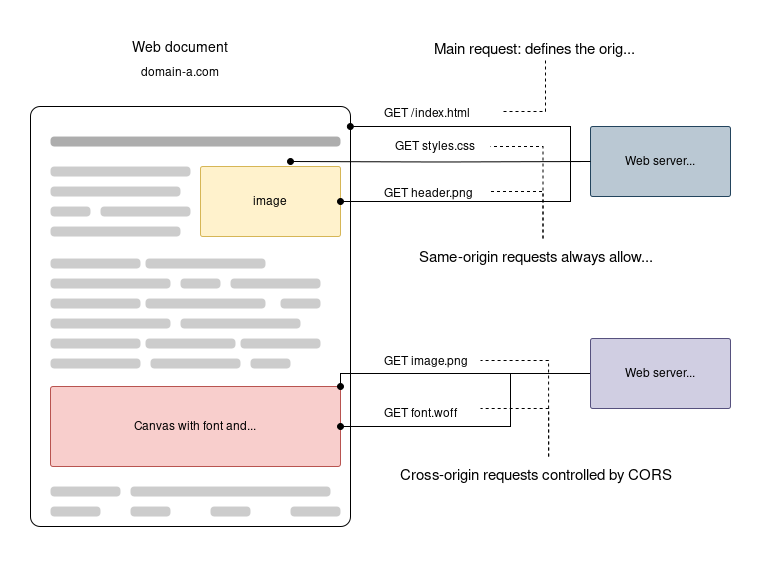
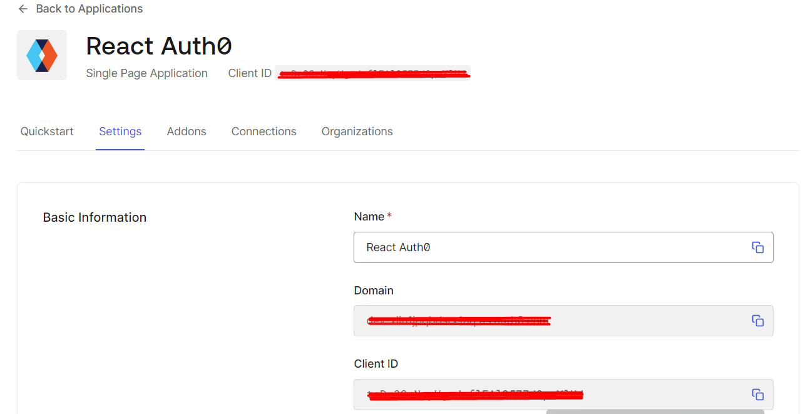
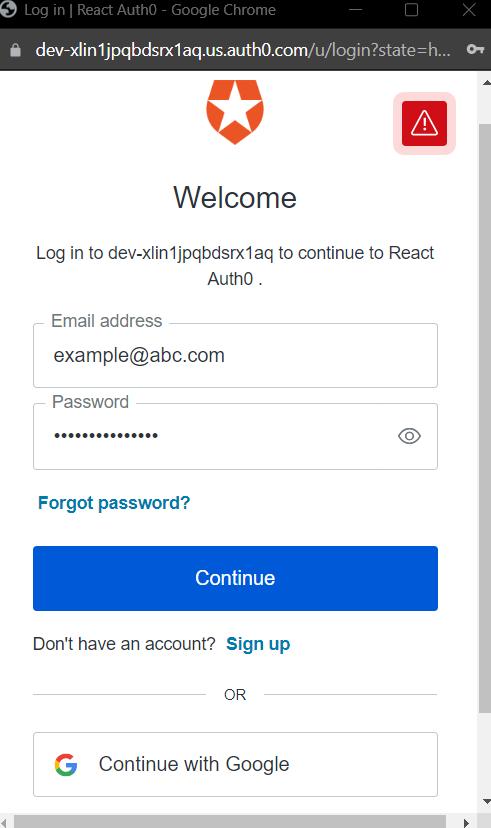
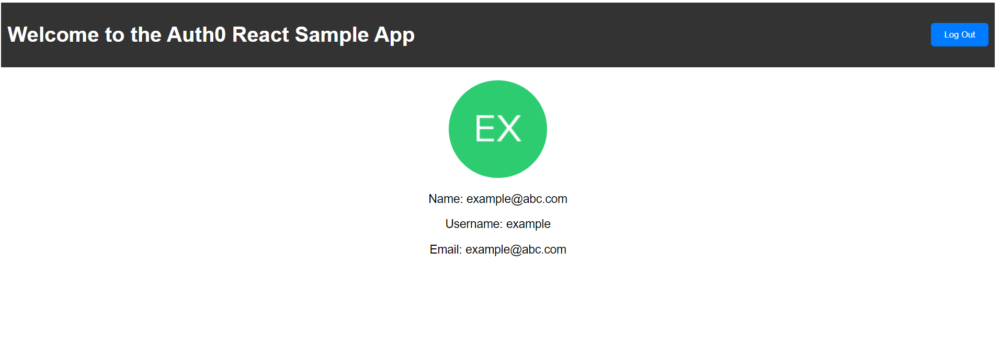
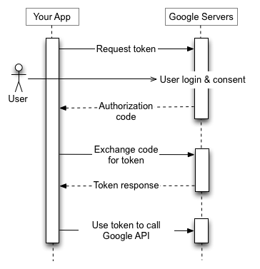

# CS3219 Toolbox - Authentication and Authorization
The CS3219 SE Toolbox is a collection of guides and resources to help you get started with the various tools and technologies used CS3219 - Software Engineering Principles and Patterns.

The guides and resources below focus on authentication and authorization. We use JSON Web Tokens (JWT) and Auth0 as examples in this guide.

# 1. Introduction
This guide aims to help you learn the basics of different authentication and authorization mechanisms. For example, JSON Web Tokens (JWT) and Auth0. These technologies play a crucial role in securing web applications by ensuring that only authorized users can access certain resources. 

<sup> ^This text was generated with the help of [ChatGPT](https://chat.openai.com/). </sup>

## 1.1. Authentication vs Authorization
The table below summarizes the differences between authentication and authorization.

| Authentication | Authorization |
| --- | --- |
| Verifies the identity of a user | Verifies whether a user has access to a resource |
| Usually done before authorization | Usually done after authentication |
| Authentication factors like passwords, tokens, biometrics, etc. are used | Factors like roles, permissions, access control lists, etc. are used |
| Eg. Logging in to a website | Eg. Accessing a file on a server, editing a document |

There are many technologies used to implement authentication and authorization. Some of the most popular ones are:
- JSON Web Tokens (JWT): Supports both authentication and token-based authorization.
- OAuth (eg. Auth0): Primarily focused on authorization but often includes authentication as part of the process.
- OpenID Connect (OIDC): Supports both authentication and authorization and is often used for Single Sign-On.
- SAML: Primarily used for Single Sign-On and web-based authentication but also supports some aspects of authorization.
- ...etc

Each of these technologies can be used in various ways and integrated into different systems to address specific authentication and authorization requirements. The choice of technology depends on your use case and requirements.

In this guide, we will be focusing on JWT and Auth0 because they provide robust and widely adopted solutions for implementing authentication and authorization in web applications. 

We will use both of these technologies to implement authentication and authorization in a sample web application. [Section 2](#2-json-web-tokens-jwt) will cover JWT and [Section 3](#3-auth0) will cover Auth0.

## 1.2. Token Storage, Refresh Tokens, and Threat Model (Best Practices)

Understanding where and how you store tokens is **critical** to app security. Here's a pragmatic baseline for modern SPAs and APIs.

<p align="center">
  
</p>

**Access token vs Refresh token**
- **Access Token**: Short-lived (e.g., 5–15 min). Used by the client to call your API (`Authorization: Bearer <token>`).
- **Refresh Token**: Long-lived (e.g., days). Used to obtain new access tokens after expiry. Should be **well protected** and never exposed to JS if you can avoid it.

**Where to store tokens?**
- **HttpOnly, Secure, SameSite cookies (recommended for Refresh Tokens)**  
  - Pros: Not readable by JS → mitigates XSS exfiltration. Sent automatically to the same origin (respecting `SameSite`).  
  - Cons: CSRF must be handled (use `SameSite=Lax/Strict` and/or anti-CSRF token). Requires careful CORS/cookie config.
- **In-memory (recommended for Access Tokens)**  
  - Pros: Vanishes on reload; not persisted → limits post-XSS impact.  
  - Cons: Lost on refresh → you'll need a refresh token to rehydrate.
- **localStorage / sessionStorage (least preferred for tokens)**  
  - Pros: Easy.  
  - Cons: Readable by JS → **XSS can steal tokens**. Use only if you understand the risks and have strong CSP + input sanitization.

**High-level flow**
1. User authenticates → server sets **HttpOnly** refresh token cookie; client receives short-lived access token (held **in memory**).
2. Access token expires → client calls `/api/auth/refresh` sending the cookie; server verifies refresh token and returns a new access token.
3. On logout → server invalidates refresh token (e.g., revoke/delete from store) and clears cookie.

**Mitigations checklist**
- Rotate refresh tokens; maintain a server-side allowlist or hashed store (DB).  
- Use short access-token TTLs; scope tokens narrowly.  
- Set cookie flags: `HttpOnly`, `Secure` (HTTPS only), `SameSite=Lax` (or `Strict` if possible), and set precise `Path`/`Domain`.  
- Add Content Security Policy (CSP) to reduce XSS blast radius.  
- Validate JWTs server-side: signature, expiration, audience, issuer, and (optionally) `jti` for reuse detection.

# 2. JSON Web Tokens (JWT)
A JSON Web Token (JWT) is an open standard for securely transmitting information between parties as a JSON object. This information can be verified and trusted because it is digitally signed.

In this section, we will be using JWT to implement authentication and authorization in a sample web application. We will also gain an understanding of managing public routes, ensuring the security of authenticated routes, and effectively employing the axios library to execute API requests while utilizing the authentication token.

We will put together a simple React app with a JSON Server (mock database) + Node backend. The app will have a login page and a conditionally rendered homepage. The login page will have a form to enter the username and password. The home page displays a message based on whether the user is logged in or not.

To get started fork/clone this repository: [SE-Toolbox-Auth-React-JWT](https://github.com/nus-CS3219/SE-Toolbox-Auth-React-JWT)

As you can see, the project uses a separate React app for the frontend and a separate Node app for the backend. The React app will be served on `localhost:3000` and the Node app will be served on `localhost:8080`. The project file structure looks like this:
```bash
SE-Toolbox-Auth-React-JWT
├── frontend
    ├── React app
├── backend
    ├── Node app
```
> 📝**Note:** The app is not complete yet. As you read on you will complete it - but first lets look at the code that is already there.

## 2.1. Frontend Setup and Explanation
_Prerequisites:_
- If you haven't already, install [NodeJS LTS](https://nodejs.org/en/download/current)
  - LTS vs18.17.0
  - npm v9.6.7
- Ensure you have an IDE installed (eg. This guide was made using [VSCode](https://code.visualstudio.com/))
- Install [git](https://git-scm.com/downloads)
- (Optional) [yarn](https://classic.yarnpkg.com/lang/en/docs/install/)
  - v1.22.19

In the frontend folder, install the dependencies:
```bash
npm install 
```
This should install [react-router-dom](https://www.npmjs.com/package/react-router-dom) and [axios](https://www.npmjs.com/package/axios). The react-router-dom package will be used to implement routing in our app. The axios package will be used to make API requests to the backend.

**Frontend File Structure (for relevant files only)**

```bash
frontend
├── public
├── src
    ├── Home.js
    ├── Login.js
    ├── App.js
    ├── NavBar.js
    ├── Register.js
├── package.json
├── package-lock.json
```
The frontend generally focuses on authorization-related code. That is, rendering components and managing what content is displayed based on the user's authentication status

The next few sections will explain the code in each of the files above. (You don't need to modify the original frontend code based on these explanations. The only exception is `index.js`.)

### 2.1.1. App.js
This code sets up the routing structure for your React application, allowing navigation between different components like Login, Register, Home, and NavBar. It also manages the `logoutUser` state, which controls the user's authentication status. The `react-router-dom` library is used for client-side routing, and components are conditionally rendered based on the current URL path.

1. In the app component, set up the user authentication state.
```js
function App() {
  const [logoutUser, setLogoutUser] = React.useState(false);
  // ...
}
```
2. Render the app component and elements that make up your app UI.
```js
return (
    <BrowserRouter>
      <div className="App">
        <h2 style={headingStyle}>JWT Authentication</h2>
        <Routes>
          <Route
            path="/"
            element={
              <NavBar
                logoutUser={logoutUser}
                setLogoutUser={setLogoutUser}
              />
            }
          />
          <Route path="/login" element={<Outlet />} />
        </Routes>
        <Routes>
          <Route path="/login" element={<Login setLogoutUser={setLogoutUser} />} />
          <Route path="/register" element={<Register setLogoutUser={setLogoutUser} />} />
          <Route path="/" element={<Home logoutUser={logoutUser}/>} /> {}
        </Routes>
      </div>
    </BrowserRouter>
  );
```
This is what the routing-related code does:

| Component/Route                           | Description                                                                                                                                                                      |
|-------------------------------------------|----------------------------------------------------------------------------------------------------------------------------------------------------------------------------------|
| `<BrowserRouter>`                         | Sets up client-side routing using the react-router-dom library.                                                                                                                   |
| `<Routes>`                                | Serves as a container for defining the routes within your application.                                                                                                            |
| `<Route path="/"> ... </Route>`           | Represents the root URL ("/") and renders the NavBar component. It also passes the `logoutUser` and `setLogoutUser` props to NavBar.                                               |
| `<Route path="/login" element={<Outlet />} />` | Defines a route path using `path="/login"` and provides `<Outlet />` as its element, creating a placeholder for child routes. This allows you to render different components based on the route path while maintaining a consistent layout structure. One of the outlets is found in `Home.js`. |
| `<Route path="/login" element={<Login setLogoutUser={setLogoutUser} />} />`    | Represents the "/login" URL and renders the Login component while passing the `setLogoutUser` prop to it.                                                                          |
| `<Route path="/register" element={<Register setLogoutUser={setLogoutUser} />} />` | Corresponds to the "/register" URL and renders the Register component while passing the `setLogoutUser` prop to it.                                                               |
| `<Route path="/" element={<Home logoutUser={logoutUser} />} />`                | Represents the root URL ("/") and renders the Home component, passing the `logoutUser` prop to it.                                                                                 |


<sup> ^This text was generated with the help of [ChatGPT](https://chat.openai.com/). </sup>

### 2.1.2. Login.js
Login component is responsible for rendering a login form, handling user input, making a POST request to the backend server for authentication, and displaying error messages. It also manages the user's login state and provides a link to the registration page.

1. In the Login component, manage the component state with `useState` hooks.
```js
const Login = ({ setLogoutUser }) => {
  const [username, setUsername] = useState("");
  const [password, setPassword] = useState("");
  const [error, setError] = useState("");
  const navigate = useNavigate();
  // ...
}
```
2. [Inside Login component] Handle user login by making a POST request to the backend server. Define a function `login` that is triggered when the login form is submitted.
```js
const login = async (event) => {
    event.preventDefault();
    try {
        const response = await axios.post("http://localhost:8080/api/auth/login", {
        username,
        password,
      });

      console.log("response", response);
      localStorage.setItem(
        "login",
        JSON.stringify({
          userLogin: true,
          token: response.data.access_token,
        })
      );
      setError("");
      setUsername("");
      setPassword("");
      setLogoutUser(false);
      navigate("/");
      console.log("login successful");
    } catch (error) {
      if (error.response !== undefined) {
        setError(error.response.data.message);
      }
      console.log(error);
    }
  };
```
If the login is successful (no errors), it stores the user's login status and JWT token in the browser's local storage using localStorage.setItem, updates states, and navigates the user to the home page. 

If there is an error (catch block), it checks if the error response exists (error.response) and updates the error state with the error message if available.

<sup> ^This text was generated with the help of [ChatGPT](https://chat.openai.com/). </sup>

### 2.1.3. Register.js
This code defines a Register component responsible for rendering a user registration form, handling user input, making a POST request to the backend server for registration, and displaying error messages. It also manages the user's login state and provides a link to the login page.

1. In the Register component, manage the component state with `useState` hooks.
```js
const Register = ({ setLogoutUser }) => {
  const [username, setUsername] = useState("");
  const [password, setPassword] = useState("");
  const [error, setError] = useState("");
  const navigate = useNavigate();
  // ...
};
```
2. [Inside Register component] Handle user registration by making a POST request to the backend server. Define a function `register` that is triggered when the registration form is submitted.
```js
  const register = async (event) => {
    event.preventDefault();
    try {
      const response = await axios.post("http://localhost:8080/api/auth/register", {
        username,
        password,
      });

      console.log("response", response);
      localStorage.setItem(
        "login",
        JSON.stringify({
          userLogin: true,
          token: response.data.access_token,
        })
      );
      setError("");
      setUsername("");
      setPassword("");
      setLogoutUser(false);
      navigate("/");
      console.log("Registration successful");
    } catch (error) {
      if (error.response !== undefined) {
        setError(error.response.data.message);
      }
      console.error(error);
    }
  };
```
If the registration is successful (no errors), it stores the user's login status and JWT token in the browser's local storage using localStorage.setItem, updates states, and navigates the user to the home page.

If there is an error (catch block), it checks if the error response exists (error.response) and updates the error state with the error message if available.

<sup> ^This text was generated with the help of [ChatGPT](https://chat.openai.com/). </sup>

### 2.1.4. Home.js
 This code creates a dynamic Home component that adjusts its content based on whether a user is logged in or not. It encourages users to log in or register if they are not logged in and displays a personalized welcome message and additional content if they are logged in.

 1. Check if the user is logged in or not.
 ```js
 const isLoginTrue = JSON.parse(localStorage.getItem("login"));
 ```
 Checks if the user is logged in by attempting to retrieve the "login" data from the browser's local storage. Recall the login data is stored in local storage as described in Login.js and Register.js. It parses the stored JSON data into a JavaScript object.
 
2. Render the component based on the user's authentication status.
 ```js
  const userNotLogin = () => (
    // This function renders content for users who are not logged in.
  );

  const userLoggedIn  = () => (
    // This function renders content for users who are logged in. 
  );
```
3. Perform conditional rendering based on the user's authentication status.
```js
 return (
    <div style={containerStyle}>
      {isLoginTrue && isLoginTrue.userLogin ? (
        <>{userLoggedIn()}</>
      ) : (
        <>{userNotLogin()}</>
      )}
    </div>
  );
  ```
If the user is logged in, the userLoggedIn() function is called. Otherwise, the userNotLogin() function is called.

### 2.1.5. NavBar.js
This code defines a NavBar component that displays either a "Logout" or a "Login" link in the navigation bar based on the user's login state. It retrieves and hydrates the user's login status from local storage and provides a logout mechanism.

1. In the NavBar component, manage the component state with `useState` hooks.
```js
const NavBar = ({ logoutUser, setLogoutUser }) => {
  const [login, setLogin] = useState("");
  // ...
};
```
2. [Inside NavBar component] Retrieve the user's login status from local storage and hydrate the login state.
```js
  useEffect(() => {
    hydrateStateWithLocalStorage();
  }, [logoutUser]);

  const logout = () => {
    localStorage.removeItem("login");
    setLogoutUser(true);
  };

  const hydrateStateWithLocalStorage = () => {
    if (localStorage.hasOwnProperty("login")) {
      let value = localStorage.getItem("login");
      try {
        value = JSON.parse(value);
        setLogin(value);
      } catch (e) {
        setLogin("");
      }
    }
  };
```
- `useEffect` hook: Calls the `hydrateStateFromLocalStorage` function when the logoutUser state changes. This effect is responsible for hydrating the login state variable with data from local storage when the component loads.
- `const hydrateStateFromLocalStorage = () => { ... }`: Defines a function that checks if the "login" data exists in the browser's local storage. If the data exists, it retrieves and attempts to parse it into a JavaScript object. If parsing is successful, it sets the login state with the parsed value; otherwise, it sets login to an empty string.
- `logout` function: Removes the "login" data from the browser's local storage and sets the logoutUser state to true.

<sup> ^This text was generated with the help of [ChatGPT](https://chat.openai.com/). </sup>

## 2.2. Backend Setup and Explanation
The frontend uses axios to make API requests to the backend. The backend is responsible for authenticating users and generating JWT tokens.

In the backend folder, install the dependencies:
```bash
npm install 
```
This should install fs, body-parser, json-server, jsonwebtoken:
- [fs](https://www.npmjs.com/package/fs): To read and write files.
- [body-parser](https://www.npmjs.com/package/body-parser): To parse incoming request bodies.
- [json-server](https://www.npmjs.com/package/json-server): A lightweight and easy-to-use Node. js tool that simulates a RESTful API using a JSON file as the data source.
- [jsonwebtoken](https://www.npmjs.com/package/jsonwebtoken): To generate JWT tokens.

This backend uses a mock REST API to store user data. The user data is stored in a JSON file called `users.json`. The JSON file contains an array of user objects. Each user object has a username and password field.

You can replace this mock REST API with a real database like MongoDB, PostgreSQL etc.

**Backend File Structure (for relevant files only)**

```bash
backend
├── server.js
├── users.json
├── package.json
├── package-lock.json
```
The backend generally focuses on authentication-related code. That is, generating JWT tokens, and verifying JWT tokens. It contains the following endpoints:
- `POST /api/auth/login`: Authenticates the user and generates a JWT token.
- `POST /api/auth/register`: Registers the user and generates a JWT token.

You may add more endpoints to the backend to suit your needs. For example, you may add an endpoint to retrieve user data from the database.

You will notice that the backend is not complete yet. In this section we will complete the backend `server.js` file.

### 2.2.1. server.js
This code defines the backend server and implements the authentication-related endpoints. It also implements a middleware function to verify JWT tokens.

Add the following code to the `server.js` file:

1. Import the necessary libraries.
```js
const fs = require('fs');
const bodyParser = require('body-parser');
const jsonServer = require('json-server');
const jwt = require('jsonwebtoken');
```
2. Create a JSON server.
```js
/**
 * JSON Server is a lightweight and easy-to-use Node. js tool that simulates 
 * a RESTful API using a JSON file as the data source.
 * You may replace the JSON server with your own API server and database.
 */
const server = jsonServer.create();
```
3. Set up the JSON server.
```js
server.use(bodyParser.urlencoded({ extended: true }));
server.use(bodyParser.json());
server.use(jsonServer.defaults());
```
4. Define a secret key for signing JWT tokens.
```js
const SECRET_KEY = '123456789'; // Replace with your secret key or use env variable
```
5. Define expiration time for JWT tokens.
```js
const expiresIn = '1h';
```
6. Define a function to create a JWT token.
```js
// Create a JWT token
function createToken(payload) {
  return jwt.sign(payload, SECRET_KEY, { expiresIn });
}
```
7. Define a function to check if the user is Authenticated.
```js
// Check if the user is authenticated
function isAuthenticated({ username, password }) {
  const userdb = JSON.parse(fs.readFileSync('./users.json', 'UTF-8'));
  return (
    userdb.users.findIndex(
      (user) => user.username === username && user.password === password
    ) !== -1
  );
}
```
8. Define a function to check if the user is Registered.
```js
// Check if the user is registered
function isRegistered({ username }) {
  const userdb = JSON.parse(fs.readFileSync('./users.json', 'UTF-8'));
  return (
    userdb.users.findIndex(
      (user) => user.username === username
    ) !== -1
  );
}
```
9.  Define the API endpoint for user registration.
```js
server.post('/api/auth/register', (req, res) => {
    const { username, password } = req.body;
    if (isRegistered({ username }) === true) {
      const status = 401;
      const message = 'Credentials already exist';
      res.status(status).json({ status, message });
      return;
    }

    fs.readFile('./users.json', (err, data) => {
        if (err) {
          const status = 401;
          const message = err;
          res.status(status).json({ status, message });
          return;
        }
        let userData = JSON.parse(data.toString());
        const last_item_id = userData.users[userData.users.length - 1].id;
        userData.users.push({ id: last_item_id + 1, username:username, password:password }); 
        fs.writeFile('./users.json', 
        JSON.stringify(userData), 
        (err, result) => {  
            if (err) {
                const status = 401;
                const message = err;
                res.status(status).json({ status, message });
                return;
            }
        });
    });

    const access_token = createToken({ username, password });
    res.status(200).json({ access_token });
});
```
We will see what each line of code does below.

| Code                                               | Description                                                                                       |
| -------------------------------------------------- | ------------------------------------------------------------------------------------------------- |
| `server.post('/api/auth/register', (req, res) => { ... })` | Defines the POST /api/auth/register endpoint. It accepts a username and password in the request body and returns a JWT token if the registration is successful. |
| `const { username, password } = req.body;`          | Destructures the username and password from the request body.                                     |
| `if (isRegistered({ username }) === true) { ... }`   | Checks if the user is already registered. If the user is already registered, it returns an error message. |
| `fs.readFile('./users.json', (err, data) => { ... })` | Reads the users.json file and parses it into a JavaScript object.                                  |
| `userData.users.push({ id: last_item_id + 1, username:username, password:password });` | Adds the new user to the users array. |
| `fs.writeFile('./users.json', JSON.stringify(userData), (err, result) => { ... })` | Writes the updated users array to the users.json file. |
| `const access_token = createToken({ username, password });` | Creates a JWT token using the username and password. |
| `res.status(200).json({ access_token });`           | Returns the JWT token in the response body.                                                        |
| `res.status(status).json({ status, message });`     | In case of errors, returns an error message in the response body.                                    |


10.  Define the API endpoint for user login.
```js
server.post('/api/auth/login', (req, res) => {
  const { username, password } = req.body;
  if (isAuthenticated({ username, password }) === false) {
    const status = 401;
    const message = 'Incorrect username or password';
    res.status(status).json({ status, message });
    return;
  }
  const access_token = createToken({ username, password });
  res.status(200).json({ access_token });
});
```
We will see what each line of code does below.

| Code                                               | Description                                                                                       |
| -------------------------------------------------- | ------------------------------------------------------------------------------------------------- |
| `server.post('/api/auth/login', (req, res) => { ... })` | Defines the POST /api/auth/login endpoint. It accepts a username and password in the request body and returns a JWT token if the login is successful. |
| `const { username, password } = req.body;`          | Destructures the username and password from the request body.                                     |
| `if (isAuthenticated({ username, password }) === false) { ... }` | Checks if the user is authenticated. If the user is not authenticated, it returns an error message. |
| `const access_token = createToken({ username, password });` | Creates a JWT token using the username and password. |
| `res.status(200).json({ access_token });`           | Returns the JWT token in the response body.                                                        |
| `res.status(status).json({ status, message });`     | In case of errors, returns an error message in the response body.                                    |


11.  Run the server.
```js
server.listen(8080, () => {
  console.log('Running Auth API Server');
});
```

Your completed server.js file should look like this:
```js
const fs = require('fs');
const bodyParser = require('body-parser');
const jsonServer = require('json-server');
const jwt = require('jsonwebtoken');
/**
 * JSON Server is a lightweight and easy-to-use Node. js tool that simulates 
 * a RESTful API using a JSON file as the data source.
 * You may replace the JSON server with your own API server and database.
 */
const server = jsonServer.create();

server.use(bodyParser.urlencoded({ extended: true }));
server.use(bodyParser.json());
server.use(jsonServer.defaults());

const SECRET_KEY = '123456789'; // Replace with your secret key or use env variable

const expiresIn = '1h';

// Create a JWT token
function createToken(payload) {
  return jwt.sign(payload, SECRET_KEY, { expiresIn });
}

// Check if the user is authenticated
function isAuthenticated({ username, password }) {
  const userdb = JSON.parse(fs.readFileSync('./users.json', 'UTF-8'));
  return (
    userdb.users.findIndex(
      (user) => user.username === username && user.password === password
    ) !== -1
  );
}
// Check if the user is registered
function isRegistered({ username }) {
  const userdb = JSON.parse(fs.readFileSync('./users.json', 'UTF-8'));
  return (
    userdb.users.findIndex(
      (user) => user.username === username
    ) !== -1
  );
}

// API endpoint for user registration
server.post('/api/auth/register', (req, res) => {
    const { username, password } = req.body;
    if (isRegistered({ username }) === true) {
      const status = 401;
      const message = 'Credentials already exist';
      res.status(status).json({ status, message });
      return;
    }

    fs.readFile('./users.json', (err, data) => {
        if (err) {
          const status = 401;
          const message = err;
          res.status(status).json({ status, message });
          return;
        }
        let userData = JSON.parse(data.toString());
        const last_item_id = userData.users[userData.users.length - 1].id;
        userData.users.push({ id: last_item_id + 1, username:username, password:password }); //add some data
        fs.writeFile('./users.json', 
        JSON.stringify(userData), 
        (err, result) => {  // WRITE
            if (err) {
                const status = 401;
                const message = err;
                res.status(status).json({ status, message });
                return;
            }
        });
    });

    const access_token = createToken({ username, password });
    res.status(200).json({ access_token });
});

server.post('/api/auth/login', (req, res) => {
  const { username, password } = req.body;
  if (isAuthenticated({ username, password }) === false) {
    const status = 401;
    const message = 'Incorrect username or password';
    res.status(status).json({ status, message });
    return;
  }
  const access_token = createToken({ username, password });
  res.status(200).json({ access_token });
});

server.listen(8080, () => {
  console.log('Running Auth API Server');
});
```

## 2.3. Putting it all together
Now that we have completed the frontend and backend, we can put it all together and test it out.

1. Start the backend server.
```bash
cd backend
node server.js
```
You should see the following message in the terminal:
```bash
Running Auth API Server
```
1. Open a new terminal. Start the frontend.
```bash
cd frontend
npm start # or yarn start
```
3. Open your browser and navigate to `localhost:3000`. You should see the login page. Some example users have been created for you already (see backend/users.json). For example, you may use the following credentials to login:
```bash
username: abc@example.com
password: 12345678
```
4. After logging in, you should see the home page with a welcome message. You may also logout by clicking on the "Logout" button in the navigation bar.
5. You may also try logging in with an invalid username or password to see the error message.
6. Register a new user by clicking on the "Register" link in the login page. Notice that the `users.json` file is updated with the new user data upon registraion.
7. Try registering a user with an existing username to see the error message.

Yay! You have successfully implemented authentication and authorization in a sample web application using JWT. You may now use this as a reference to implement authentication and authorization in your own web applications.

> 🔍**Further Exploration:** This is a very basic implementation of authentication and authorization. You can add more features to it to suit your needs. For example, you may add an endpoint to retrieve user data from the database. This would require changes to 
> - the frontend (to make the API request)
> - the frontend (to display the user data)
> - the backend (to handle the API request and return the user data)
> - the backend (to verify the JWT token and return the user data)
> 
> Think about how you would verify the JWT token and return user data from the database. You can use the `jsonwebtoken` library to verify the JWT token and the `fs` library to read the `users.json` file.


### 2.4. Adding Refresh Tokens to the JWT Sample (Server & Client)

Below extends the sample **Node** backend to issue and rotate refresh tokens securely. This is an educational baseline — in production, store refresh tokens **hashed** in a DB and use HTTPS.

**Server: refresh token issuing & rotation**

```js
// backend/server.js (additions)

const crypto = require('crypto');
const cors = require('cors');

// CORS (adjust origins as needed)
server.use(cors({
  origin: 'http://localhost:3000',
  credentials: true // allow cookies
}));

// Helpers
function genRefreshToken() {
  return crypto.randomBytes(64).toString('hex');
}

// Persist refresh tokens (demo only — use DB in prod)
function readUsers() {
  return JSON.parse(fs.readFileSync('./users.json', 'UTF-8'));
}
function writeUsers(data) {
  fs.writeFileSync('./users.json', JSON.stringify(data, null, 2));
}

// After successful login/register, also create a refresh token cookie
function issueSession(res, { username }) {
  const access_token = createToken({ username }); // short-lived
  const refresh_token = genRefreshToken();        // long-lived
  const db = readUsers();
  const u = db.users.find(u => u.username === username);
  u.refresh_token = refresh_token; // store (hash in prod)
  writeUsers(db);

  // HttpOnly cookie (demo flags; tune in prod)
  res.cookie('rt', refresh_token, {
    httpOnly: true,
    secure: false,      // set true in HTTPS
    sameSite: 'Lax',
    path: '/api/auth'
  });
  return access_token;
}

// Update existing /register and /login handlers to use issueSession
// Example (inside register success and login success):
//   const access_token = issueSession(res, { username });
//   return res.status(200).json({ access_token });

// Add refresh endpoint
server.post('/api/auth/refresh', (req, res) => {
  try {
    const rt = req.cookies?.rt;
    if (!rt) return res.status(401).json({ message: 'Missing refresh token' });
    const db = readUsers();
    const user = db.users.find(u => u.refresh_token === rt);
    if (!user) return res.status(401).json({ message: 'Invalid refresh token' });

    // rotate
    const newRt = genRefreshToken();
    user.refresh_token = newRt;
    writeUsers(db);

    res.cookie('rt', newRt, {
      httpOnly: true,
      secure: false,
      sameSite: 'Lax',
      path: '/api/auth'
    });
    const access_token = createToken({ username: user.username });
    res.json({ access_token });
  } catch (e) {
    res.status(500).json({ message: 'Refresh failed' });
  }
});

// Add logout to revoke RT
server.post('/api/auth/logout', (req, res) => {
  const rt = req.cookies?.rt;
  const db = readUsers();
  const user = db.users.find(u => u.refresh_token === rt);
  if (user) {
    delete user.refresh_token;
    writeUsers(db);
  }
  res.clearCookie('rt', { path: '/api/auth' });
  res.json({ ok: true });
});
```

🛠️ **Note**: You'll need cookie-parser and to initialize it:

```bash
npm i cors cookie-parser
```

```js
const cookieParser = require('cookie-parser');
server.use(cookieParser());
```

**Client: silent refresh (store access token in memory, fall back to refresh on 401)**

```js
// frontend/src/api.js
import axios from 'axios';

let accessToken = null;

export const api = axios.create({
  baseURL: 'http://localhost:8080',
  withCredentials: true // send/receive cookies
});

api.interceptors.request.use((config) => {
  if (accessToken) config.headers.Authorization = `Bearer ${accessToken}`;
  return config;
});

let refreshing = false;
let queue = [];

api.interceptors.response.use(
  r => r,
  async (error) => {
    const original = error.config || {};
    if (error.response?.status === 401 && !original._retry) {
      original._retry = true;
      if (!refreshing) {
        refreshing = true;
        try {
          const { data } = await api.post('/api/auth/refresh');
          accessToken = data.access_token;
          queue.forEach((p) => p.resolve(accessToken));
          queue = [];
        } catch (e) {
          queue.forEach((p) => p.reject(e));
          queue = [];
          throw e;
        } finally {
          refreshing = false;
        }
      }
      // wait for refresh
      const token = await new Promise((resolve, reject) => queue.push({ resolve, reject }));
      original.headers.Authorization = `Bearer ${token}`;
      return api(original);
    }
    throw error;
  }
);

export function setAccessToken(token) { accessToken = token; }
```

Use `setAccessToken(access_token)` after login/register success. On 401s, the interceptor attempts `/api/auth/refresh` using the HttpOnly refresh token cookie.

### 2.5. CORS Configuration (Local Dev)

If your frontend runs on localhost:3000 and API on localhost:8080, configure CORS so browsers allow cross-origin requests and cookies.

<p align="center">
  
</p>

**Server (Node/Express/json-server)**

```js
// backend/server.js
const cors = require('cors');
server.use(cors({
  origin: 'http://localhost:3000',
  credentials: true, // allow cookies/Authorization headers
}));
```

**Client (Axios)**

```js
// ensure withCredentials for cookie-based flows
axios.defaults.withCredentials = true;
```

- Cookies require `credentials: true` on both sides.
- Preflight (OPTIONS) must succeed; don't block it.
- When deploying, set origin to your deployed frontend URL and keep HTTPS everywhere.

# 3. Auth0
[Auth0](https://auth0.com/) is a flexible, drop-in solution to add authentication and authorization services to your applications. Your team and your users can securely authenticate with passwords, social identity providers, or enterprise identity providers to get seamless, SSO access to applications.

Auth0's Universal Login is the [recommended](https://auth0.com/blog/introducing-the-new-auth0-universal-login-experience/) and most secure way to start using their login system. It redirects users to the login page, authenticates through Auth0's servers, and returns them to your app. You can begin with a basic username and password setup and easily integrate additional login methods as needed for your app.

 In this section, we will add authentication and authorization to a sample ReactJS web application using Auth0. 

 Auth0 [provides several platform integrations](https://auth0.com/docs/). For this guide, we will use the React SDK. 

 > 📝**Note:** This guide only provides insight into the ReactJS SDK for Auth0. However, Auth0 provides many different SDKs for different platforms. You may explore other SDKs according to your needs.
 

 ## 3.1. Create Auth0 Account and Configure App
1. Create an Auth0 account [here](https://auth0.com/signup). If you already have an account, then login.
2. Create a new app on your Auth0 dashboard. Select type of App as "Single Page Web Applications" and click on "Create".


<sup> Figure 3.1: Create Auth0 App </sup>

3. Select the technology you are using. In this case, we will select "React".
4. Click on "Create Application". You will be redirected to a Quick Start page. Click on Settings:


<sup> Figure 3.2: Go to the settings of your Auth0 app. </sup>

5. Specify the URL where Auth0 should redirect the user after a successful login. For this app, set the URL for **Allowed Callback URLs** to `http://localhost:3000`.
6. Specify the URL to which Auth0 should redirect the user after they log out. Set the URL for **Allowed Logout URLs** to `http://localhost:3000`.
7. Define the origins (URLs) from which Auth0 will accept authentication requests. Ensures the login persists when one leaves the app or refreshes the page. Set the URL for **Allowed Web Origins** to `http://localhost:3000`. 
  
> 📝**Note:** When you configure these Auth0 settings with `http://localhost:3000`, you are specifying that your Auth0 authentication and logout processes should interact with the web application running locally on your machine at that specific URL. You can change these settings later when you deploy your app to a different URL.

8. Scroll down and click on "Save Changes".

Your Auth0 app is now configured. You can now use the Auth0 SDK to add authentication and authorization to your app. If you want to add additional login methods, you can do so from the "Connections" tab on your Auth0 dashboard. 

## 3.2. Clone and Setup the Sample App
Fork/clone the sample app from this repository: [SE-Toolbox-Auth-React-Auth0](https://github.com/CS3219-AY2324S1/SE-Toolbox-Auth-React-Auth0.git)

In the project folder, install the dependencies:
```bash
npm install 
```
This should install `@auth0/auth0-react` for you. This is the Auth0 SDK for React.

**File Structure (for relevant files only)**

```bash
your-project-folder
├── public
├── src
  ├── NavBar.js
  ├── Profile.js
  ├── App.js
  ├── index.js
├── package.json
├── package-lock.json
```

`index.js` needs to be completed for this app to work. We will first go throught the code in the other files and then complete `index.js`.

### 3.2.1. App.js
App.js provides the structure of the React application with two components, NavBar and Profile, rendered inside the App component. The NavBar appears at the top, and the Profile appears below it with a margin to separate them.

```js
import React from 'react';
import Profile from './Profile';
import NavBar from './NavBar';

function App() {
  return (
    <div>
      <NavBar />
      <div style={{ margin: '20px' }}> {/* Add margin for separation */}
        <Profile />
      </div>
    </div>
  );
}

export default App;
```

## 3.2.2. NavBar.js
This code creates a Navbar component for a web application that adapts its appearance and functionality based on whether the user is authenticated. It uses the `useAuth0` hook for authentication handling. The main things to take note of in this file are:

1. [Inside NavBar component] `const { isAuthenticated, loginWithPopup, logout } = useAuth0();` uses destructuring to extract specific properties and functions from the `useAuth0` hook. It retrieves information on whether the user is authenticated, a function to initiate the login process, and a function to initiate the user logout.
2. [Inside NavBar component] `{isAuthenticated ? (...) : (...)}` conditionally renders the login and logout buttons based on the user's authentication status. 

## 3.2.3. Profile.js
This code creates a Profile component that displays user profile information when the user is authenticated. It uses the `useAuth0` hook to access user data. The main things to take note of in this file are:

1. [Inside Profile component] `const { user, isAuthenticated } = useAuth0();` uses destructuring to extract specific properties from the `useAuth0` hook. It retrieves information on whether the user is authenticated and the user data.
2. [Inside Profile component] `return isAuthenticated && (...)` conditionally renders the user profile information based on the user's authentication status. If the user is authenticated, it renders the content inside the parentheses. If not, it returns null (nothing is rendered). 

## 3.2.4. index.js
Now that we have seen the code in the other files, we can complete the `index.js` file. This file is responsible for rendering the App component and wrapping it with the Auth0Provider component. The Auth0Provider component provides the Auth0Context to the App component. The Auth0Context contains the `useAuth0` hook that we used in the other files.

There are some environment variables that we need to define before we can complete the `index.js` file. Navigate to your project root folder and create a `.env` file. Add the following environment variables to the `.env` file:
```bash
REACT_APP_AUTH0_DOMAIN=<YOUR AUTH0 DOMAIN>
REACT_APP_AUTH0_CLIENT_ID=<YOUR AUTH0 CLIENT ID>
REACT_APP_AUTH0_CALLBACK_URL=http://localhost:3000
```
You can obtain the values for these environment variables from your Auth0 app settings. Navigate to your Auth0 dashboard and click on "Applications". Click on the application you created earlier and go to settings. You should be able to find the domain and client ID there.



<sup>Figure 3.2.4.1. Application settings in Auth0</sup>

Now that we have defined the environment variables, we can complete the `index.js` file.

1. Import the necessary libraries.
```js
import { Auth0Provider } from "@auth0/auth0-react";
import React from "react";
import ReactDOM from "react-dom";
import App from "./App";
```
2. Obtain the domain and client ID from the environment variables.
```js
const domain = process.env.REACT_APP_AUTH0_DOMAIN;
const clientId = process.env.REACT_APP_AUTH0_CLIENT_ID;
```
3. Create the entry point for the React application.
```js
ReactDOM.render(
    // Next lines of code go here
    );
```
4. [Inside ReactDOM.render] Wrap the App component with the Auth0Provider component.

```js
<Auth0Provider
        domain={domain}
        clientId={clientId}
        redirectUri={window.location.origin}
    >
        <App />
    </Auth0Provider>,
    document.getElementById("root")
```
- `<Auth0Provider ... >`: Wraps the App component with the Auth0Provider component. It takes the following props:
  - `domain`: The Auth0 domain.
  - `clientId`: The Auth0 client ID.
  - `redirectUri`: The URL to redirect to after login. In this case, it is the current URL.
- `<App />`: Renders the App component. The entire application (and child components) are rendered with the authentication context provided by the Auth0Provider component.
- `document.getElementById("root")`: Renders the App component in the root element of the HTML document.

This code sets up Auth0 authentication for the React application by configuring the Auth0Provider component with the necessary Auth0 domain and client ID. It then renders the main App component, ensuring that all components within the app have access to authentication-related functionality provided by Auth0.

<sup> ^This text was generated with the help of [ChatGPT](https://chat.openai.com/). </sup>

You final index.js file should look like this:

```js
// Wrap the entire app in Auth0Provider component
import { Auth0Provider } from "@auth0/auth0-react";
import React from "react";
import ReactDOM from "react-dom";
import App from "./App";

const domain = process.env.REACT_APP_AUTH0_DOMAIN;
const clientId = process.env.REACT_APP_AUTH0_CLIENT_ID;

ReactDOM.render(
    <Auth0Provider
        domain={domain}
        clientId={clientId}
        redirectUri={window.location.origin}
    >
        <App />
    </Auth0Provider>,
    document.getElementById("root")
    );
```

## 3.3. Putting it all together
Now that we have added `index.js` and the environment variables, we can test out the app.

1. Navigate to the root directory of the app and start the app.
```bash
npm start # or yarn start
```
2. Open your browser and navigate to `localhost:3000`. You should see the login page.
3. Click on the "Login" button. Auth0 login should appear. You can create a new account - or login with a social account that you have added under 'Connections' in your Auth0 dashboard.
   

<sup>Figure 3.3.1. Login with Auth0</sup>

4. After logging in, you should see the profile page. You may logout by clicking on the "Logout" button in the navigation bar.



<sup>Figure 3.3.2. Profile page</sup>

Yay! You have successfully implemented authentication and authorization in a sample web application using Auth0. You may now use this as a reference to implement authentication and authorization in your own web applications.

> 🔍**Further Exploration:** This is a very basic implementation of authentication and authorization. You may add more features and define more routes according to your needs. Explore Auth0 to find out how you can define different user roles (like Maintainer, Admin etc.) and how you may define your application routes based on these roles. 


### 3.4. Google OAuth 2.0 (Direct, without Auth0)

You can integrate Google Sign-In directly using Google Identity Services (GIS) for OAuth 2.0/OIDC. This is useful when you don't need a broker like Auth0.

<p align="center">
  
</p>

**1) Create OAuth Client ID**

Go to Google Cloud Console → APIs & Services → Credentials → Create Credentials → OAuth client ID → Application type: Web application.

Add `http://localhost:3000` to Authorized JavaScript origins; add your callback route if using redirect UX.

**2) React Setup (Popup UX via @react-oauth/google)**

```bash
npm i @react-oauth/google jwt-decode
```

```jsx
// src/main.jsx or index.js
import { GoogleOAuthProvider } from '@react-oauth/google';
import App from './App';

const clientId = import.meta.env.VITE_GOOGLE_CLIENT_ID || process.env.REACT_APP_GOOGLE_CLIENT_ID;

ReactDOM.render(
  <GoogleOAuthProvider clientId={clientId}>
    <App />
  </GoogleOAuthProvider>,
  document.getElementById('root')
);
```

```jsx
// src/GoogleLoginButton.jsx
import { GoogleLogin } from '@react-oauth/google';
import jwtDecode from 'jwt-decode';
import { api, setAccessToken } from './api';

export default function GoogleLoginButton() {
  return (
    <GoogleLogin
      onSuccess={async (credentialResponse) => {
        // Google returns a credential (JWT). Send it to your backend to exchange for your app's session.
        const idToken = credentialResponse.credential; // JWT
        const { data } = await api.post('/api/auth/google', { idToken });
        setAccessToken(data.access_token); // short-lived access token from your API
      }}
      onError={() => console.log('Login Failed')}
      useOneTap
    />
  );
}
```

**3) Backend: Verify Google ID Token, issue your JWTs**

```bash
npm i google-auth-library
```

```js
// backend/google.js
const { OAuth2Client } = require('google-auth-library');
const client = new OAuth2Client(process.env.GOOGLE_CLIENT_ID);

// POST /api/auth/google
server.post('/api/auth/google', async (req, res) => {
  try {
    const { idToken } = req.body;
    const ticket = await client.verifyIdToken({
      idToken,
      audience: process.env.GOOGLE_CLIENT_ID,
    });
    const payload = ticket.getPayload(); // {sub, email, name, picture, ...}
    const username = payload.email;

    // upsert user, then issue session (access + refresh cookie)
    const access_token = issueSession(res, { username });
    res.json({ access_token });
  } catch (e) {
    res.status(401).json({ message: 'Google token invalid' });
  }
});
```

**Notes**
- Always verify the Google ID token server-side (audience, issuer, expiry).
- Map Google users to your internal users; decide what fields you trust.
- You can combine this with the refresh-token flow from Section 2.4.

### 3.5. Firebase Authentication (Email/Password + Google)

Firebase Auth is a popular managed solution that supports email/password, social providers, multi-tenancy, and more. Below is a minimal React setup with Email/Password and Google sign-in.

<p align="center">
  
</p>

**1) Install & initialize**

```bash
npm i firebase
```

```js
// src/firebase.js
import { initializeApp } from 'firebase/app';
import { getAuth, GoogleAuthProvider } from 'firebase/auth';

const firebaseConfig = {
  apiKey: import.meta.env.VITE_FB_API_KEY,
  authDomain: import.meta.env.VITE_FB_AUTH_DOMAIN,
  projectId: import.meta.env.VITE_FB_PROJECT_ID,
  appId: import.meta.env.VITE_FB_APP_ID,
};

const app = initializeApp(firebaseConfig);
export const auth = getAuth(app);
export const googleProvider = new GoogleAuthProvider();
```

**2) Email/Password sign-up & sign-in**

```js
// src/authEmail.js
import { auth } from './firebase';
import { createUserWithEmailAndPassword, signInWithEmailAndPassword, signOut } from 'firebase/auth';

export async function registerEmailPassword(email, password) {
  const { user } = await createUserWithEmailAndPassword(auth, email, password);
  return user;
}

export async function loginEmailPassword(email, password) {
  const { user } = await signInWithEmailAndPassword(auth, email, password);
  return user;
}

export function logout() { return signOut(auth); }
```

**3) Google sign-in (Popup)**

```js
// src/authGoogle.js
import { auth, googleProvider } from './firebase';
import { signInWithPopup } from 'firebase/auth';

export async function loginWithGoogle() {
  const { user } = await signInWithPopup(auth, googleProvider);
  return user;
}
```

**4) Using Firebase ID Token with your API**

```js
// After Firebase login, exchange Firebase ID token for your API tokens
import { auth } from './firebase';
import { api, setAccessToken } from './api';

export async function exchangeFirebaseToken() {
  const idToken = await auth.currentUser.getIdToken(/* forceRefresh? */);
  const { data } = await api.post('/api/auth/firebase', { idToken });
  setAccessToken(data.access_token);
}
```

**5) Backend: Verify Firebase ID Token**

```bash
npm i firebase-admin
```

```js
// backend/firebase.js
const admin = require('firebase-admin');
const serviceAccount = require('./service-account.json'); // from Firebase console

admin.initializeApp({
  credential: admin.credential.cert(serviceAccount)
});

server.post('/api/auth/firebase', async (req, res) => {
  try {
    const { idToken } = req.body;
    const decoded = await admin.auth().verifyIdToken(idToken);
    const username = decoded.email || decoded.uid;
    const access_token = issueSession(res, { username }); // reuse refresh flow
    res.json({ access_token });
  } catch (e) {
    res.status(401).json({ message: 'Firebase token invalid' });
  }
});
```

**Security notes**
- Treat Firebase as your Identity Provider; your backend still issues your access/refresh tokens for your APIs.
- Enforce auth in your API using JWT middleware (validate signature, exp, aud/iss).
- For Firestore/RTDB usage, set proper Security Rules — auth alone isn't authorization.

# 4. References
The following resources were used to create this guide:

## Core Authentication & JWT
- [This video tutorial on Authentication with JWT and React](https://youtu.be/UCTj-diBS-E?si=yZ0qopfc20-UaWk2)
- [This article on JWT-based login for React-Express Apps](https://medium.com/@vrinmkansal/quickstart-jwt-based-login-for-react-express-app-eebf4ea9cfe8)
- [This blogpost on React JWT Authentication (without Redux) example](https://www.bezkoder.com/react-jwt-auth/)

## Token Security & Best Practices
- [Auth0 Docs: Refresh Tokens](https://auth0.com/docs/secure/tokens/refresh-tokens) - Referenced for Section 1.2. Token Storage, Refresh Tokens, and Threat Model
- [Auth0 Docs: Refresh Token Rotation](https://auth0.com/docs/secure/tokens/refresh-tokens/refresh-token-rotation) - Referenced for Section 2.4. Adding Refresh Tokens

## CORS & Browser Security
- [MDN Web Docs: Cross-Origin Resource Sharing (CORS)](https://developer.mozilla.org/en-US/docs/Web/HTTP/CORS) - Referenced for Section 2.5. CORS Configuration

## OAuth & Social Authentication
- [Google Identity: OAuth 2.0](https://developers.google.com/identity/protocols/oauth2) - Referenced for Section 3.4. Google OAuth 2.0
- [This article on Authenticating React Apps with Auth0](https://www.smashingmagazine.com/2020/11/authenticating-react-apps-auth0/)
- [Auth0 Docs](https://auth0.com/docs/)

## Firebase Authentication
- [Firebase Documentation: Authentication](https://firebase.google.com/docs/auth) - Referenced for Section 3.5. Firebase Authentication

## Framework Documentation
- [React Router Dom Docs](https://reactrouter.com/en/main)

## AI Assistance
- Parts of this guide were generated with the help of [ChatGPT](https://chat.openai.com/).
- Parts of this guide were generated with the help of [GitHub Copilot](https://copilot.github.com/).
